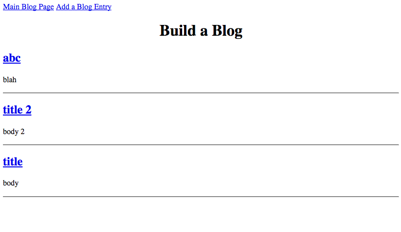
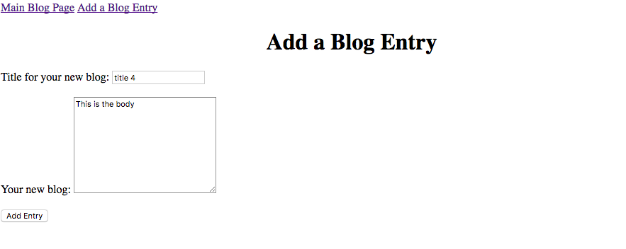
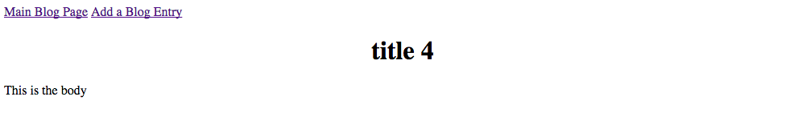

# build-a-blog

This is a blogging web application that displays blog posts on a main page and allows new posts to be created on a form page.  Upon form submission, the user is redirected to a page showing just that new post.  Each post has a title and body.

This web app was implemented in Python using the Flask web framework and the Jinja2 templating engine. It uses SQLAlchemy as an ORM to access a MySQL database containing a blog table.

## List of Blog Posts Page

## Add a Blog Form

## Blog Post Detail Page

# Author
Jeff T
